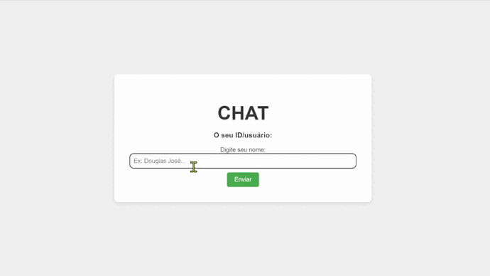

# Chat — WebSocket com FastAPI, Python e Docker

Projeto de Chat com WebSocket usando FastAPI, Docker-Compose e MongoDB.



## Pré-requisitos: Ambiente Virtual

Antes de começar, é necessário criar e ativar um ambiente virtual para gerenciar as dependências de forma isolada. Siga os passos abaixo:

1. Criar o ambiente virtual + ative:
  ```bash
   python -m venv venv
  ````
  ```bash
   venv\Scripts\activate
  ````
2. Instale as dependências
  ```bash
    pip install -r requirements.txt
  ````
3. Configure o Python no VS Code
   
    Certifique-se de que o VS Code está usando o Python do ambiente virtual:
    - Abra o Comando Rápido: Ctrl + Shift + P (ou Cmd + Shift + P no macOS).
    - Digite e selecione Python: Select Interpreter.
    - Escolha o caminho do Python do seu ambiente virtual (venv).
 
## Instruções para Execução
1. Construir e iniciar os serviços Docker:
  - Abra o Docker Desktop, antes de rodar o código abaixo!
  ```bash
  docker-compose up --build
  ```
2. Acessar/Testar a aplicação Websocket:
- Conecte-se ao WebSocket para enviar e receber mensagens, abra várias abas diferentes e envie mensagem simultaneamente:
  ```bash
  http://localhost:8000/
  ```
## Funcionalidade de Salvamento de Dados
Quando o cliente envia o nome, os dados são salvos automaticamente no MongoDB

  ```bash
  {
    "client_id": 1627398193,
    "client_name": "João",
    "connected_at": "2023-09-05 10:30:45"
  }
  ```

## Dependências
As dependências do projeto estão listadas em `requirements.txt` e incluem:
  - FastAPI
  - Uvicorn
  - Websockets
  - Pymongo
  - Entre outros

